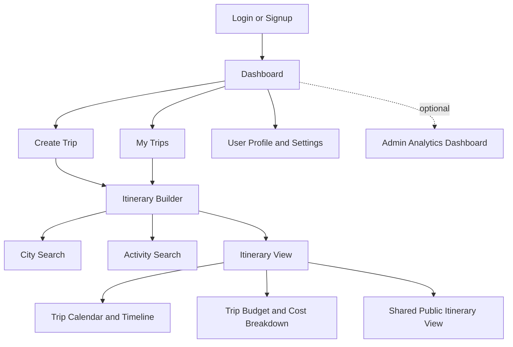
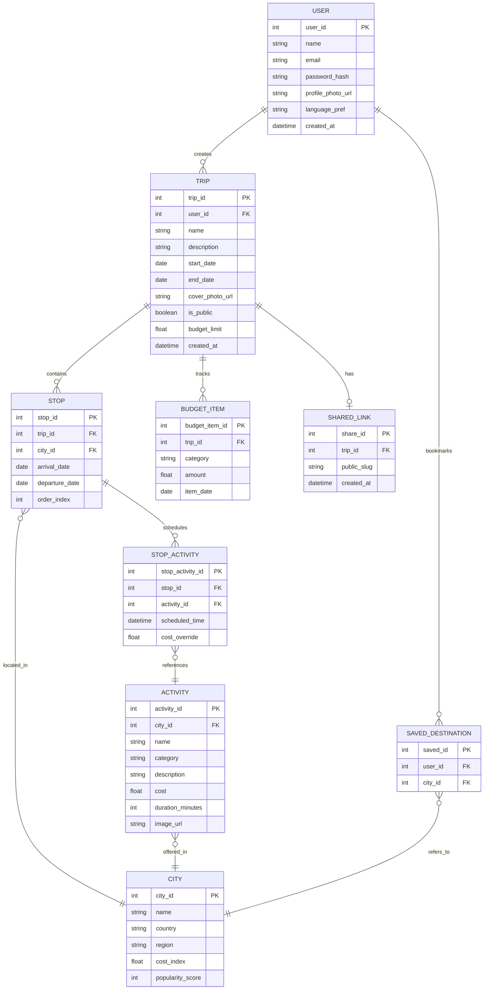
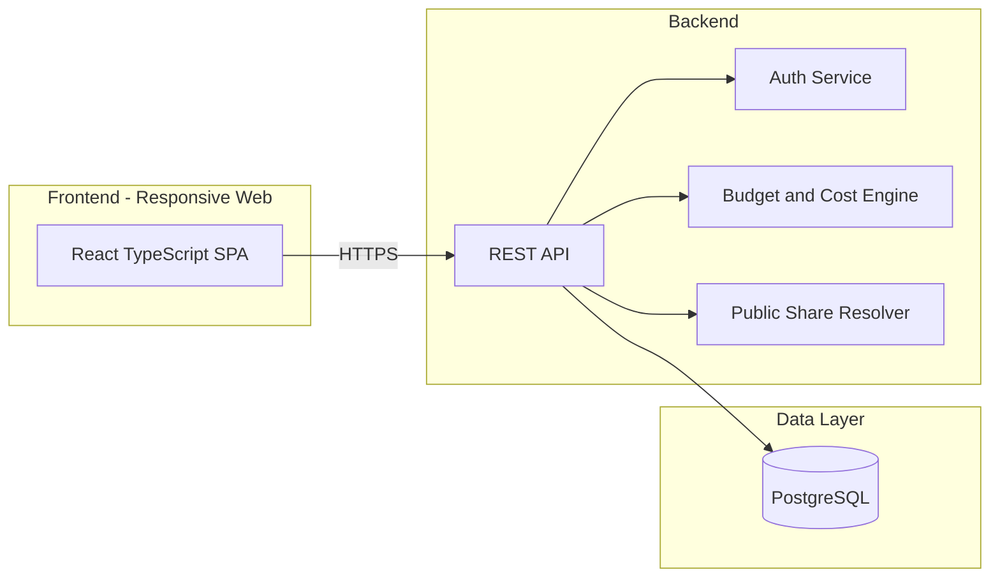

# GlobeTrotter — Product Requirements Document (PRD)

| | |
|---|---|
| **Prepared for** | Odoo Hackathon |
| **Document status** | Draft v1.0 |
| **Last updated** | August 22, 2026 |
| **Source brief** | GlobeTrotter — Empowering Personalized Travel Planning (problem statement) |

---

## Table of Contents

1. [Executive Summary](#1-executive-summary)
2. [Problem Statement](#2-problem-statement)
3. [Goals and Objectives](#3-goals-and-objectives)
4. [Target Users and Personas](#4-target-users-and-personas)
5. [Scope](#5-scope)
6. [User Stories](#6-user-stories)
7. [Functional Requirements](#7-functional-requirements)
8. [Non-Functional Requirements](#8-non-functional-requirements)
9. [Screen Flow](#9-screen-flow)
10. [Data Model](#10-data-model)
11. [Tech Stack](#11-tech-stack)
12. [System Architecture](#12-system-architecture)
13. [Success Metrics](#13-success-metrics)
14. [Suggested Milestones](#14-suggested-milestones)
15. [Assumptions and Open Questions](#15-assumptions-and-open-questions)
16. [Risks and Mitigations](#16-risks-and-mitigations)
17. [Out of Scope](#17-out-of-scope)
18. [Appendix](#18-appendix)

---

## 1. Executive Summary

GlobeTrotter is a personalized, intelligent, and collaborative travel-planning platform. It lets users design multi-city itineraries, discover cities and activities, automatically estimate and track trip budgets, visualize their journey on a calendar/timeline, and share finished plans publicly or with friends. The platform is built on a relational database so that trips, stops, cities, activities, and expenses are structured, queryable data rather than unstructured notes.

## 2. Problem Statement

Travelers planning multi-city trips today rely on a patchwork of tools — spreadsheets, notes apps, blog posts, and separate booking sites — to answer three recurring questions:

1. **Where am I going, and in what order?** (routing, dates, durations)
2. **What will I do, and what will it cost?** (activities, budgets)
3. **How do I see the whole plan at a glance, and share it?** (visualization, collaboration)

GlobeTrotter addresses all three inside one responsive application, backed by a relational schema that lets the system compute budgets, timelines, and recommendations automatically instead of requiring manual bookkeeping.

## 3. Goals and Objectives

**Product goals**
- Let a user go from "blank trip" to a complete, budgeted, multi-city itinerary in one session
- Make trip cost visible and controllable at every step, not just at the end
- Make a finished trip easy to visualize and easy to share

**Hackathon goals**
- Demonstrate a well-normalized relational schema (trips → stops → cities/activities → costs)
- Ship a working, demo-able flow across the core screens within the hackathon timebox
- Present a clear, judge-friendly narrative: create trip → build itinerary → see budget → share

## 4. Target Users and Personas

| Persona | Description | Primary needs |
|---|---|---|
| **The Multi-City Planner** | Planning a trip across several cities/countries | Stop sequencing, per-city budgets, timeline view |
| **The Budget-Conscious Traveler** | Wants to see cost impact of every decision | Live cost breakdown, overbudget alerts |
| **The Inspiration Seeker** | Doesn't know where to go yet | City/activity discovery and search, popular destinations |
| **The Social Sharer** | Wants to show off or hand off a finished plan | Public itinerary link, "Copy Trip" |
| **The Admin** *(optional)* | Platform owner monitoring usage | Analytics dashboard |

## 5. Scope

### In scope (MVP)
- Auth (signup, login, forgot password)
- Dashboard with recent trips and quick actions
- Create/list/edit/delete trips
- Itinerary builder (add/reorder stops, assign cities & dates, attach activities)
- Itinerary view (timeline + grouped-by-city)
- City search & filter
- Activity search & filter
- Budget & cost breakdown with charts
- Calendar/timeline view
- Public/shared read-only itinerary page
- Profile & settings

### Stretch scope
- Admin/analytics dashboard
- Social sharing integrations
- Collaborative (multi-editor) trips

## 6. User Stories

Organized by screen/module. Format: *As a [user], I want to [action], so that [benefit].*

**Auth**
- As a new user, I want to sign up with email and password, so that I can save my trips.
- As a returning user, I want to log in, so that I can access my saved trips.
- As a user who forgot my password, I want to reset it, so that I can regain access.

**Dashboard**
- As a user, I want to see my upcoming trips on login, so that I don't have to search for them.
- As a user, I want to see popular/recommended destinations, so that I get inspiration for a new trip.

**Trip creation & management**
- As a user, I want to create a trip with a name, dates, and description, so that I have a container for my plan.
- As a user, I want to see all my trips as cards with key info, so that I can quickly find the one I need.
- As a user, I want to edit or delete a trip, so that I can keep my trip list accurate.

**Itinerary building**
- As a user, I want to add a city stop with arrival/departure dates, so that I can build a multi-city route.
- As a user, I want to reorder stops, so that my itinerary reflects my actual route.
- As a user, I want to attach activities to a stop, so that each city has a day-wise plan.

**Discovery**
- As a user, I want to search cities by name, country, or region, so that I can find where to go next.
- As a user, I want to filter activities by type, cost, and duration, so that I can find things that fit my trip.

**Budget**
- As a user, I want to see a cost breakdown by category (transport/stay/activities/meals), so that I understand where my money goes.
- As a user, I want to be alerted when a day or trip goes over budget, so that I can adjust before it's too late.

**Visualization**
- As a user, I want to view my itinerary as a calendar or a list, so that I can pick whichever is clearer to me.
- As a user, I want to drag-and-reorder activities on the calendar, so that adjusting my plan is fast.

**Sharing**
- As a user, I want to publish a read-only link to my itinerary, so that others can view it without an account.
- As a viewer, I want to copy someone's public trip into my own account, so that I can use it as a starting point.

**Profile**
- As a user, I want to update my profile info and preferences, so that the app reflects who I am.
- As a user, I want to delete my account, so that I control my own data.

**Admin** *(optional)*
- As an admin, I want to see platform-wide stats (top cities, engagement), so that I can understand how the app is used.

## 7. Functional Requirements

Requirement IDs are grouped by screen for traceability back to the source brief.

### 7.1 Login / Signup (FR-1.x)
- FR-1.1 System shall allow account creation with email + password, with basic format/strength validation.
- FR-1.2 System shall allow login with email + password.
- FR-1.3 System shall provide a "Forgot Password" flow (email-based reset).
- FR-1.4 System shall show inline validation errors (invalid email, weak password, existing account, etc.).

### 7.2 Dashboard / Home (FR-2.x)
- FR-2.1 System shall display a welcome message and the user's most recent trips.
- FR-2.2 System shall surface a "Plan New Trip" call to action.
- FR-2.3 System shall show recommended destinations and budget highlights.

### 7.3 Create Trip (FR-3.x)
- FR-3.1 System shall let users set a trip name, start date, end date, and description.
- FR-3.2 System shall support an optional cover photo upload.
- FR-3.3 System shall validate that end date is not before start date.

### 7.4 My Trips / Trip List (FR-4.x)
- FR-4.1 System shall list all of a user's trips as cards showing name, date range, and destination count.
- FR-4.2 System shall support edit, view, and delete actions per trip.

### 7.5 Itinerary Builder (FR-5.x)
- FR-5.1 System shall let users add a stop (city + arrival/departure dates) to a trip.
- FR-5.2 System shall let users reorder stops (drag-and-drop or up/down controls).
- FR-5.3 System shall let users assign one or more activities to a stop.
- FR-5.4 System shall recompute the trip's date range and cost automatically as stops change.

### 7.6 Itinerary View (FR-6.x)
- FR-6.1 System shall render the itinerary as a day-wise layout grouped by city.
- FR-6.2 System shall show activity blocks with time and cost.
- FR-6.3 System shall support toggling between calendar and list view.

### 7.7 City Search (FR-7.x)
- FR-7.1 System shall provide a search bar for cities by name.
- FR-7.2 System shall display country, cost index, and popularity for each result.
- FR-7.3 System shall support filtering by country/region.
- FR-7.4 System shall let users add a searched city directly to a trip as a stop.

### 7.8 Activity Search (FR-8.x)
- FR-8.1 System shall let users browse activities scoped to a stop's city.
- FR-8.2 System shall support filtering by type, cost, and duration.
- FR-8.3 System shall show a quick-view with description and image.
- FR-8.4 System shall support add/remove of an activity to/from a stop.

### 7.9 Trip Budget & Cost Breakdown (FR-9.x)
- FR-9.1 System shall compute an estimated total cost per trip from its stops/activities.
- FR-9.2 System shall break costs down by category: transport, stay, activities, meals.
- FR-9.3 System shall render the breakdown as pie and/or bar charts.
- FR-9.4 System shall show average cost per day.
- FR-9.5 System shall flag days or the overall trip as over budget when a user-set limit is exceeded.

### 7.10 Trip Calendar / Timeline (FR-10.x)
- FR-10.1 System shall render a calendar or vertical timeline of the full itinerary.
- FR-10.2 System shall support expandable day views.
- FR-10.3 System shall support drag-to-reorder of activities within/across days.

### 7.11 Shared / Public Itinerary View (FR-11.x)
- FR-11.1 System shall generate a public, unauthenticated URL for a trip the owner marks shareable.
- FR-11.2 System shall render a read-only itinerary summary at that URL.
- FR-11.3 System shall provide a "Copy Trip" action that duplicates the itinerary into the viewer's own account.
- FR-11.4 System shall provide social-sharing affordances (share links/buttons).

### 7.12 User Profile / Settings (FR-12.x)
- FR-12.1 System shall let users edit name, photo, and email.
- FR-12.2 System shall let users set a language preference.
- FR-12.3 System shall let users delete their account.
- FR-12.4 System shall maintain a list of saved/bookmarked destinations.

### 7.13 Admin / Analytics Dashboard (FR-13.x) — *optional*
- FR-13.1 System shall show tables/charts of trips created over time.
- FR-13.2 System shall show top cities and top activities.
- FR-13.3 System shall show user engagement stats and basic user management tools.

## 8. Non-Functional Requirements

| Category | Requirement |
|---|---|
| **Usability** | Core flow (create trip → add stops → see budget) completable without instructions |
| **Responsiveness** | Fully usable on both desktop and mobile viewports |
| **Performance** | Itinerary and budget views should reflect edits in under 1s (optimistic UI where possible) |
| **Data integrity** | Foreign-key constraints between trips/stops/cities/activities; no orphaned records |
| **Security** | Passwords hashed (never stored in plaintext); public share links expose only what's needed |
| **Privacy** | Users control what's public via an explicit share/publish action, not by default |
| **Accessibility** | Sufficient color contrast on charts/budget alerts; keyboard-navigable forms |
| **Scalability** | Schema supports many cities/activities without per-trip duplication (shared reference tables) |

## 9. Screen Flow

## 10. Data Model

**Notes**
- `CITY` and `ACTIVITY` are shared reference tables — a city or activity is defined once and reused across every trip that includes it, which is what makes City Search / Activity Search fast and consistent.
- `STOP_ACTIVITY` is a join table so an activity can appear on many stops, and a stop can have many activities, each with its own scheduled time.
- `BUDGET_ITEM` can either be derived on the fly (sum of stop/activity costs) or persisted per category for faster reads — persisting is recommended for the Budget screen's charts.
- `SHARED_LINK` is 1:0..1 with `TRIP` — a trip either has no public link or exactly one.

## 11. Tech Stack

| Layer | Suggested Choice | Why |
|---|---|---|
| Frontend | React + TypeScript + Vite | Fast iteration, strong typing for a data-heavy app |
| Styling | Tailwind CSS | Consistent UI without hand-rolled CSS |
| State | Zustand | Simple global state for the in-progress itinerary |
| Backend | Supabase (Postgres + Auth + Storage) or Node/Express + Postgres | Satisfies the relational-DB requirement directly; Supabase also gives auth & file storage for free |
| Charts | Recharts or Chart.js | Budget pie/bar charts |
| Calendar | FullCalendar or react-big-calendar | Timeline/calendar screen |
| Deployment | Vercel/Netlify + Supabase/Railway | Fast, free-tier friendly for a demo |

> If the hackathon specifically requires building on the **Odoo platform/framework**, swap the backend row for Odoo's ORM + module system (Python) instead — the data model above maps directly onto Odoo models (custom models for `trip`, `stop`, `city`, `activity`, extending `res.partner` for users). Confirm this constraint with the organizers before locking the stack in.

## 12. System Architecture

## 13. Success Metrics

**For the hackathon demo**
- All MVP screens are navigable end-to-end without a crash
- A judge can create a 2–3 city trip, add activities, and see an accurate budget in under 3 minutes
- The public share link works and renders a clean read-only view

**For the product (post-hackathon framing)**
- % of started trips that reach a "complete itinerary" state
- Average time from trip creation to first stop added
- Budget-alert accuracy vs. actual reported spend
- Share-link click-through and "Copy Trip" rate

## 14. Suggested Milestones

> Generic 3-phase plan — compress or expand to fit your actual hackathon duration.

| Phase | Focus | Deliverables |
|---|---|---|
| **Phase 1 — Foundation** | Schema, auth, trip CRUD | DB schema live, signup/login working, Create/List/Edit/Delete Trip |
| **Phase 2 — Core Planning** | Itinerary + discovery + budget | Itinerary Builder, City/Activity Search, Budget breakdown with charts |
| **Phase 3 — Polish & Demo** | Visualization, sharing, QA | Calendar/timeline view, public share page, bug fixes, deploy, demo script |

## 15. Assumptions and Open Questions

- Assumed the hackathon does **not** mandate the Odoo framework itself — "Odoo Hackathon" is treated as the event name/sponsor. **Confirm with organizers.**
- Assumed city/activity data can be seeded manually or from a small static dataset rather than a live third-party travel API (no API was specified in the brief).
- Assumed single-owner trips for MVP (no real-time multi-user collaboration) — collaboration is listed as stretch scope.
- Open question: is a submission format (repo + deployed link + demo video) specified by the organizers? Not covered in the source brief.

## 16. Risks and Mitigations

| Risk | Mitigation |
|---|---|
| Scope too large for the timebox (13 screens) | Build MVP list first (§5); treat Admin dashboard as stretch |
| No real travel-cost data source | Seed a small curated dataset of cities/activities with plausible costs |
| Relational schema under time pressure | Lock the ER diagram (§10) before writing code; migrations first |
| Calendar drag-and-reorder is complex | Ship list/timeline view first, add drag interactions only if time remains |

## 17. Out of Scope

- Real payment processing or booking integrations (flights/hotels)
- Real-time multi-user co-editing of a trip
- Native mobile apps (web-responsive only, per the brief)
- Third-party travel API integrations (unless the team chooses to add one)

## 18. Appendix

- **Source document:** GlobeTrotter — Empowering Personalized Travel Planning (hackathon problem statement)
- **Mockups:** [Excalidraw board](https://link.excalidraw.com/l/65VNwvy7c4X/6CzbTgEeSr1)
- **Related document:** [README.md](./README.md)
