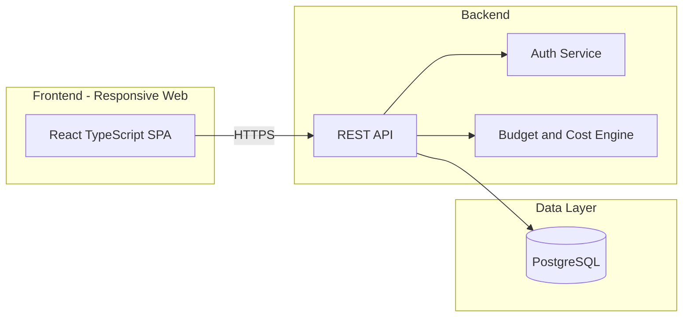

# 🌍 GlobeTrotter — Empowering Personalized Travel Planning

**Hackathon:** Odoo Hackathon
**Track:** Travel & Trip Planning
**Status:** 🚧 In Development

GlobeTrotter is a personalized, intelligent, and collaborative travel planning platform. It gives travelers an end-to-end tool to design multi-city itineraries, estimate costs, visualize their journey, and share plans with others — turning the planning process into part of the fun.

---

## Table of Contents

- [Problem Statement](#problem-statement)
- [Key Features](#key-features)
- [App Screens](#app-screens)
- [Tech Stack](#tech-stack)
- [System Architecture](#system-architecture)
- [Data Model](#data-model)
- [Getting Started](#getting-started)
- [Project Structure](#project-structure)
- [Design and Mockups](#design-and-mockups)
- [Roadmap](#roadmap)
- [Team](#team)
- [License](#license)

---

## Problem Statement

Planning a multi-city trip is complex: travelers juggle spreadsheets, blog posts, and booking sites just to figure out where to go, what to do, and what it will cost. GlobeTrotter solves this by giving users a single place to:

- Add and manage travel stops and durations
- Explore cities and activities of interest
- Estimate trip budgets automatically
- Visualize timelines and plans
- Share trip plans with others

The platform is backed by a relational database that models trips, stops, cities, and activities as first-class, queryable data — not just free text — so that budgets, timelines, and recommendations can all be derived automatically.

## Key Features

- 🔐 **Account & Auth** — email/password signup, login, and password recovery
- 🧭 **Dashboard** — upcoming trips, popular cities, and quick actions at a glance
- ➕ **Trip Creation** — name, date range, description, and optional cover photo
- 🗺️ **Itinerary Builder** — add stops, assign cities and dates, reorder legs, attach activities
- 📅 **Itinerary & Calendar Views** — day-wise timeline or calendar, with drag-to-reorder
- 🔍 **City & Activity Search** — filterable discovery by country/region, type, cost, and duration
- 💰 **Budget & Cost Breakdown** — transport/stay/activities/meals split, charts, overbudget alerts
- 🔗 **Public Sharing** — read-only shareable itinerary pages with a "Copy Trip" action
- ⚙️ **Profile & Settings** — editable profile, language preference, saved destinations
- 📊 **Admin Analytics** *(optional/stretch)* — usage stats, top cities/activities, user management

## App Screens

| # | Screen | Purpose |
|---|--------|---------|
| 1 | Login / Signup | Authenticate users to manage personal travel plans |
| 2 | Dashboard / Home | Navigate to trips and surface inspiration |
| 3 | Create Trip | Start a new trip with name, dates, and description |
| 4 | My Trips (Trip List) | Access and manage existing/upcoming trips |
| 5 | Itinerary Builder | Construct the day-wise plan: cities, dates, activities |
| 6 | Itinerary View | Review the completed plan as a timeline or by city |
| 7 | City Search | Discover and add cities to a trip |
| 8 | Activity Search | Browse and add activities per stop |
| 9 | Trip Budget & Cost Breakdown | See estimated costs and stay within budget |
| 10 | Trip Calendar / Timeline | Visualize the journey on a calendar or timeline |
| 11 | Shared / Public Itinerary View | Public, read-only, shareable trip page |
| 12 | User Profile / Settings | Manage profile, preferences, and privacy |
| 13 | Admin / Analytics Dashboard *(optional)* | Monitor adoption and platform usage |

Full detail on each screen — including field-level requirements — is in [PRD.md](./PRD.md).

## Tech Stack

> Proposed stack — swap freely for whatever your team ships fastest with. The one hard requirement from the brief is a **relational database**.

| Layer | Suggested Choice | Notes |
|---|---|---|
| Frontend | React + TypeScript + Vite | Fast dev loop, component-driven UI |
| Styling | Tailwind CSS | Rapid, consistent styling for a hackathon timeline |
| State Management | Zustand | Lightweight global state for trip/itinerary data |
| Backend / API | Supabase (Postgres + Auth + Storage) *or* Node.js + Express | Supabase gives you a relational DB, auth, and file storage out of the box |
| Database | PostgreSQL | Satisfies the relational-database requirement; models trips/stops/cities/activities cleanly |
| Charts | Recharts / Chart.js | Budget pie & bar charts |
| Calendar | FullCalendar or react-big-calendar | Trip Calendar / Timeline screen |
| Hosting | Vercel/Netlify (frontend) + Supabase or Railway (backend) | Fast, free-tier friendly deploys for demo day |

## System Architecture



## Data Model

See [PRD.md § Data Model](./PRD.md#10-data-model) for the full entity-relationship diagram covering Users, Trips, Stops, Cities, Activities, and Budget Items.

## Getting Started

> These are placeholder instructions — update once the repo is scaffolded.

### Prerequisites
- Node.js ≥ 18
- npm or pnpm
- A PostgreSQL instance (local, or a free Supabase project)

### Setup

```bash
# Clone the repo
git clone <repo-url>
cd globetrotter

# Install dependencies
npm install

# Configure environment variables
cp .env.example .env
# fill in DATABASE_URL, SUPABASE_URL, SUPABASE_ANON_KEY, etc.

# Run database migrations / seed
npm run db:migrate
npm run db:seed

# Start the dev server
npm run dev
```

The app should now be running at `http://localhost:5173` (or your configured port).

## Project Structure

```
globetrotter/
├── src/
│   ├── components/     # Reusable UI components
│   ├── screens/        # One folder per screen (Dashboard, ItineraryBuilder, ...)
│   ├── hooks/          # Custom React hooks
│   ├── store/          # Zustand stores
│   ├── lib/             # API client, Supabase client, helpers
│   ├── types/           # Shared TypeScript types
│   └── App.tsx
├── server/               # (if using a separate backend)
│   ├── routes/
│   ├── controllers/
│   └── db/
├── public/
├── .env.example
└── README.md
```

## Design and Mockups

Low-fidelity mockups: [Excalidraw board](https://link.excalidraw.com/l/65VNwvy7c4X/6CzbTgEeSr1)

## Roadmap

- [ ] Auth (signup/login/forgot password)
- [ ] Trip CRUD (create/list/edit/delete)
- [ ] Itinerary builder (stops, cities, activities)
- [ ] City & activity search with filters
- [ ] Budget breakdown + charts
- [ ] Calendar/timeline view
- [ ] Public sharing page
- [ ] Profile & settings
- [ ] Stretch: Admin analytics dashboard

## Team

| Name | Role |
|---|---|
| _Add name_ | _Add role_ |
| _Add name_ | _Add role_ |

## License

_Add a license (e.g. MIT) if this project will be open-sourced after the hackathon._
